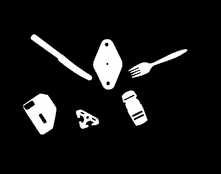
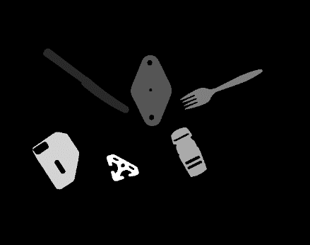
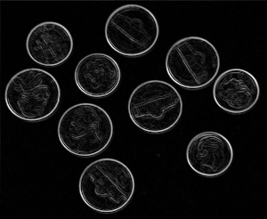
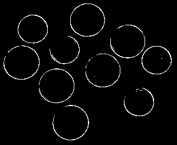

# Computer Vision

This project consists of the homework for CS661 Computer Vision in JHU.

## Basic Object Attributes

* Gray-level Convertion



* Image Segmentation and Labeling



* Object Position, Orientation, and Roundedness Calculation

```python
[{'label': '42', 'position': {'x': 188.3515625, 'y': 501.90033143939394}, 'orientation': '-0.9276542436224109', 'roundness': '0.007633528961638961'},
{'label': '85', 'position': {'x': 331.9617982504706, 'y': 482.21769460746316}, 'orientation': '-0.03987675446586884', 'roundness': '0.307267440249892'},
{'label': '127', 'position': {'x': 475.3399815894446, 'y': 483.9671678428966}, 'orientation': '1.1675489073070997', 'roundness': '0.020855451285962175'},
{'label': '170', 'position': {'x': 413.6556685685934, 'y': 348.95137682957085}, 'orientation': '-0.45288690948267896', 'roundness': '0.17394416151886227'},
{'label': '212', 'position': {'x': 130.16157675232074, 'y': 332.15229382483517}, 'orientation': '-0.1224149829919692', 'roundness': '0.5078766943974351'},
{'label': '255', 'position': {'x': 265.9671412924425, 'y': 313.64622124863087}, 'orientation': '-1.0778269977535113', 'roundness': '0.4809122478567924'}]
```

## Hough Transformation

* Edge Detection (Sobel Mask)



* Circle Detection (Hough Tranform)


